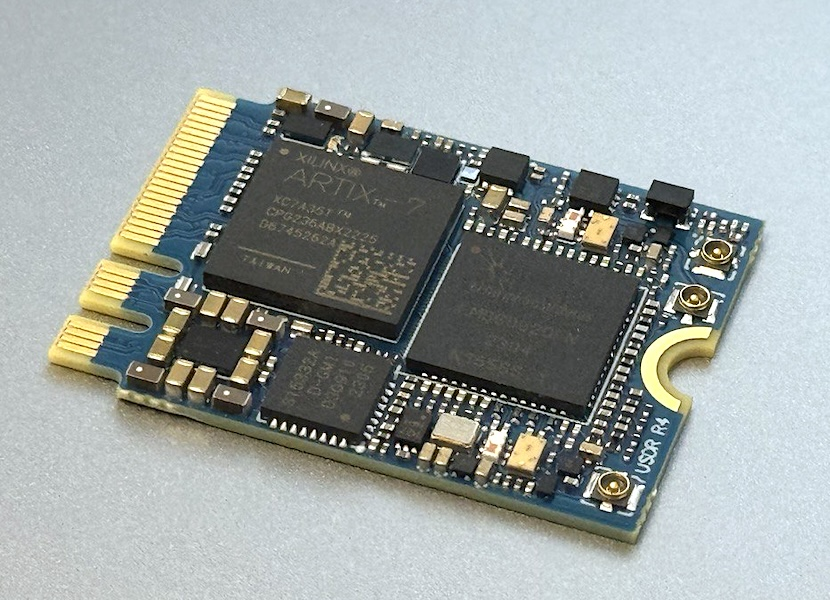
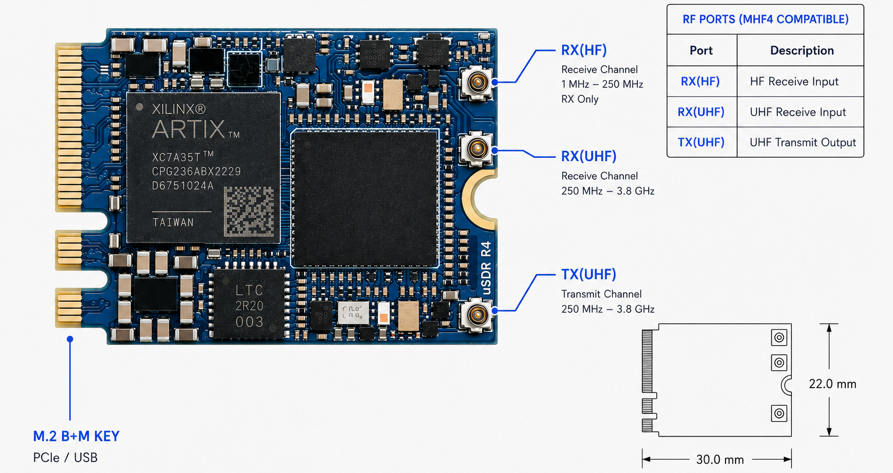

uSDR module
===========

A compact single-channel Software Defined Radio module designed for embedded RF systems, portable spectrum monitoring, and browser-based SDR applications.

Introduction
============

The uSDR is an **embedded Software Defined Radio (SDR) module** designed for integration into compact RF systems, edge computing platforms, industrial devices, and portable wireless applications.

Featuring a dedicated **HF receive path from 1 MHz to 250 MHz** and full **RX/TX operation from 250 MHz to 3.8 GHz**, the uSDR provides broad frequency coverage in a compact M.2 form factor.

By combining the uSDR with the **wsdr.io WebSDR platform**, users can deploy SDR applications directly from a web browser, remotely access hardware, stream IQ data, and build distributed RF systems without complex software installation.

Key Features
============

- Single-channel SDR architecture
- Dedicated HF receive path from 1 MHz to 250 MHz
- RX/TX coverage from 250 MHz to 3.8 GHz
- Up to 65 MSps sample rate
- Up to 40 MHz channel bandwidth
- Compact M.2 2230 A+E key form factor
- USB 2.0 and PCIe 2.0 x2 host interface
- Low-power embedded operation
- Compatible with WebSDR, GNU Radio, SoapySDR, SDR++, CubicSDR, and GQRX

General Specifications
======================

**FPGA**  
  - AMD Artix-7 XC7A35T
  - AMD Artix-7 XC7A50T

**Power Consumption**  
  - 2.1 W Typical  
  - 3.6 W Max  

**Interface**  
  - M.2 2230 A+E key  
  - USB 2.0  
  - PCIe 2.0 x2  

**Power Supply Range**  
  - 2.85 V to 5.5 V  

**Form Factor**  
  - Single-sided M.2 2230 A+E key  

RF Specifications
=================

**RFIC**  
  - LMS6002D  

**HF Receiver**  
  - LTC5562-based receive path  
  - Dedicated HF input  
  - Integrated 7th-order 250 MHz low-pass filter  

**Frequency Range**  
  - RX/TX: 250 MHz to 3.8 GHz  
  - RX-only: 1 MHz to 250 MHz  

**Sample Rate**  
  - 0.1 MSps to 65 MSps  

**Channel Bandwidth**  
  - 0.5 MHz to 40 MHz  

**RF Architecture**  
  - Single RX / Single TX  
  - Full-duplex operation in UHF band  

Temperature Range
=================

**Standard Version**  
  - 0°C to +85°C  

**Extended Temperature Version**  
  - -40°C to +105°C, on request  

Pinout
===================

Embedded Integration
====================

The uSDR is designed for applications where compact size, low power consumption, and flexible RF access are critical.

Typical deployment targets include:

- Embedded Linux systems
- Industrial computers
- Portable RF analyzers
- Wireless gateways
- Edge computing platforms
- Educational and research systems
- Mini PCIe platforms using an adapter

WebSDR Platform
===============

The uSDR integrates directly with the **Wavelet Lab WebSDR platform**, enabling browser-based SDR operation without software installation or driver configuration.

Using wsdr.io, users can:

- Run SDR applications directly in a browser
- Access hardware remotely
- Stream and share IQ data
- Deploy RF applications in minutes
- Build distributed RF sensor networks
- Collaborate across multiple locations

Target Applications
===================

**Cellular Communication**  
  - Develop LTE and cellular research systems using platforms such as **srsRAN** and **Amarisoft**  

**Spectrum Monitoring**  
  - Build compact RF monitoring and signal analysis systems  

**HF and Shortwave Reception**  
  - Monitor HF communications, amateur radio bands, and shortwave signals through the dedicated HF receive path  

**Embedded Applications**  
  - Integrate SDR functionality into compact embedded products and edge devices  

**Data Link**  
  - Build wireless communication links and remotely connected SDR systems through the WebSDR platform  

**Education and Research**  
  - Learn SDR concepts, develop custom protocols, and accelerate RF experimentation  

Software Support
================

**Web Platform**  
  - wsdr.io WebSDR Platform  

**Native Applications**  
  - GNU Radio  
  - SoapySDR  
  - SDR++  
  - CubicSDR  
  - GQRX  
  - srsRAN  
  - Custom SDR applications  

Licensing
=========

**Host Software**  
  - MIT License  

**FPGA Gateware**  
  - CERN-OHL-P-2.0  

