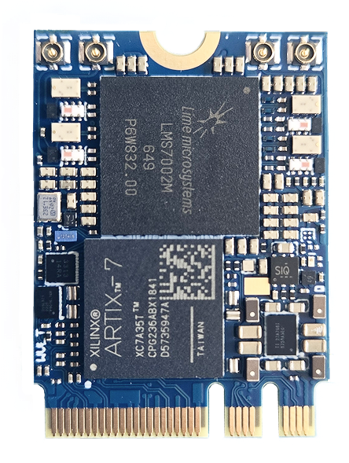
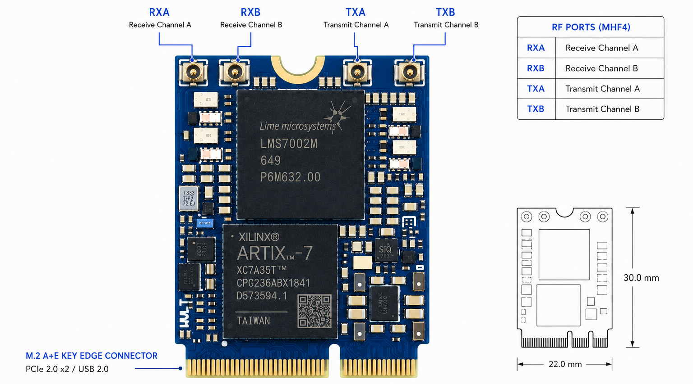

xSDR module
===========

A compact 2RX/2TX Software Defined Radio module in a single-sided M.2 2230 A+E key form factor.

Introduction
============

The xSDR is an **embedded M.2 Software Defined Radio (SDR) card** designed for integration into compact RF systems, edge platforms, laptops, industrial computers, and custom embedded devices.

It provides **2 receive and 2 transmit channels**, an **RF tuning range from 30 MHz to 3.8 GHz**, and a compact **M.2 2230 A+E key** form factor with **USB 2.0 and PCIe 2.0 x2** host interfaces.

By combining the xSDR with the **wsdr.io WebSDR platform**, users can run SDR applications directly from a browser, stream or share IQ data, and build distributed RF systems without complex driver or software installation.

Key Features
============

- 2 RX / 2 TX SDR architecture
- 30 MHz to 3.8 GHz frequency range
- Up to 100 MSps sample rate
- Up to 90 MHz channel bandwidth
- M.2 2230 A+E key single-sided form factor
- USB 2.0 and PCIe 2.0 x2 host interface
- External clock synchronization
- Low-power embedded operation
- WebSDR, GNU Radio, SoapySDR, srsRAN, and Amarisoft support

General Specifications
======================

**FPGA**  
  - AMD Artix-7 XC7A50T
  - AMD Artix-7 XC7A35T 

**RFIC**  
  - Lime Microsystems LMS7002M  

**Configuration**  
  - 2 RX / 2 TX  

**Power Consumption**  
  - 1.9 W Typical  
  - 3 W Max  

**Interface**  
  - M.2 2230 A+E key  
  - USB 2.0  
  - PCIe 2.0 x2  

**Power Supply Range**  
  - 2.85 V to 5.5 V  

**External Clock Synchronization**  
  - Supports synchronization of multiple boards for multi-channel and distributed RF systems  

RF Specifications
=================

**Frequency Range**  
  - 30 MHz to 3.8 GHz  

**Sample Rate**  
  - 0.1 MSps to 100 MSps  

**Channel Bandwidth**  
  - 0.5 MHz to 90 MHz  

**RF Architecture**  
  - Full-duplex direct-conversion SDR transceiver  

Pinout
====================

Embedded Integration
====================

The xSDR is designed for compact embedded deployment where size, power, and flexibility are critical. It can be integrated into:

- Embedded computers
- Edge AI platforms
- Industrial PCs
- Portable RF systems
- Robotics and unmanned systems
- Custom carrier boards
- Mini PCIe systems using an adapter

WebSDR Platform
===============

The xSDR is compatible with the **Wavelet Lab WebSDR platform**, enabling browser-based SDR workflows.

Using wsdr.io, users can:

- Run SDR applications in a browser
- Access hardware remotely
- Stream and share IQ data
- Build distributed RF sensing networks
- Collaborate across multiple locations
- Reduce setup time by avoiding complex local software installation

Target Applications
===================

**Cellular Communication**  
  - Build LTE and 5G research networks using **srsRAN** or **Amarisoft**  

**Embedded RF Systems**  
  - Add SDR capability to compact embedded platforms, edge devices, and portable systems  

**Spectrum Monitoring**  
  - Develop compact RF monitoring systems for signal detection, interference analysis, and spectrum observation  

**Distributed RF Sensing**  
  - Deploy multiple synchronized xSDR devices for distributed sensing and remote RF data collection  

**Data Link Applications**  
  - Build flexible communication links and stream data through local or web-connected SDR systems  

Software Support
================

**Web Platform**  
  - wsdr.io WebSDR platform  

**Native Software**  
  - GNU Radio  
  - SoapySDR  
  - srsRAN  
  - Amarisoft  
  - SDR++  
  - CubicSDR  
  - GQRX  

Licensing
=========

**Host Software**  
  - MIT License  

**FPGA Gateware**  
  - CERN-OHL-P-2.0  
